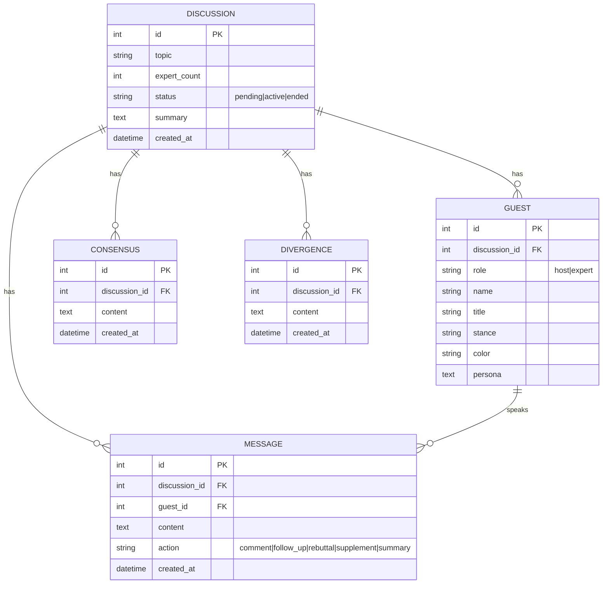

# 数据模型与 ER 图

## 实体说明
- **Discussion**：一场圆桌讨论，状态机 `pending → active → ended`。
- **Guest**：讨论中的主持人或专家，`role=host|expert`，带专属颜色。
- **Message**：一条发言，关联发言嘉宾。
- **Consensus / Divergence**：实时提炼出的共识与分歧（每轮整体替换为最新视图）。

## ER 图（Mermaid）

## 设计取舍
- **共识/分歧整体替换**而非逐条追加：因为它们是"当前讨论的快照"，由提炼 Agent 给出最新全集，避免陈旧条目累积。
- **Agent 运行状态（待机/准备/发言中）不落库**：它是瞬态的，放在内存 EventBus 中，新观众连入时由 `history` 事件重建。
- **颜色由后端确定性分配**（专家色板 + 主持金色），不交给大模型，避免颜色漂移。
