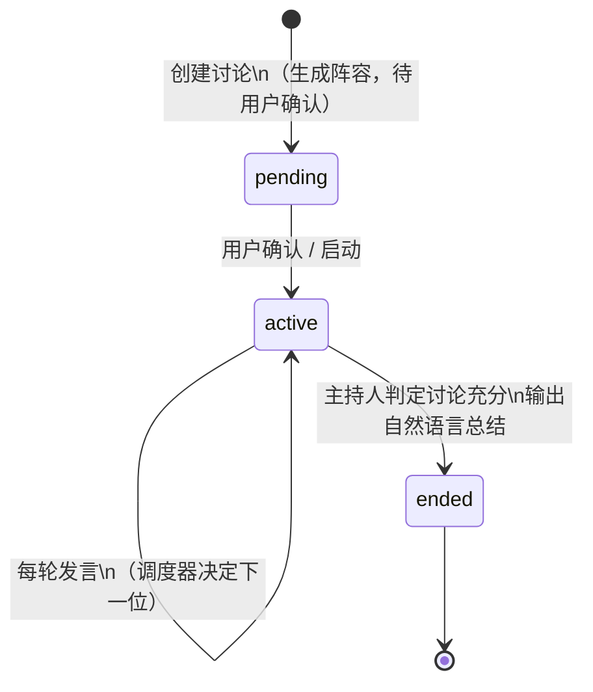
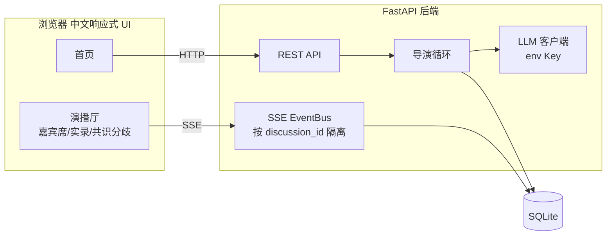

# AI 圆桌演播厅 · PRD

## 1. 产品概述
一个极简但有生产级质感的 AI 圆桌讨论演播厅：用户输入话题与专家人数，后端调用大模型动态生成「主持人 + 立场多元的专家阵容」，随后由导演循环驱动一场**非机械轮流**的讨论，实时沉淀共识与分歧，最后由主持人用自然语言收尾。

## 2. 核心用户故事
- 作为观众，我想看到一个话题下不同立场的专家真实交锋，而不是轮流念稿。
- 作为发起者，我想自定义话题与专家人数，确认阵容后进入演播厅。
- 作为观察者，我想随时加入一场进行中的讨论，看到发言、状态、共识/分歧的实时变化。

## 3. 功能需求

| 模块 | 需求 |
|---|---|
| 首页 | 讨论列表（话题/人数/状态/发言数）；可发起新讨论；可进入观察已有讨论 |
| 嘉宾生成 | 输入话题 + 专家人数 → 大模型生成主持人 + 专家（姓名/Title/立场/专属颜色），用户确认后进入演播厅 |
| 演播厅 | 主持人负责开场、追问、串联、总结；专家依据 transcript 自主决定发言（补充/反驳/追问），每次 1–2 句，禁止机械轮流 |
| 专家状态小窗 | 实时显示 待机/准备/发言中 与公开思考摘要；不暴露隐藏 CoT |
| 共识分歧 | 讨论过程中持续提炼并实时更新，不等结束 |
| Transcript | 显示姓名/Title，按专家颜色区分；不显示"举手"等内部事件 |
| 总结 | 结束时主持人自然语言总结，禁止把 JSON 原文打到页面 |
| 并行 | 多场讨论的状态/事件流/transcript/共识分歧互相隔离 |
| 实时通道 | SSE |
| 安全 | 大模型 API Key 只在后端环境变量，不进浏览器 |

## 4. 讨论状态机

## 5. 系统架构

## 6. 非功能需求
- 本地可运行：前后端分离，零前端构建。
- 响应式：超宽三栏 / 中宽两栏 / 窄屏单栏，各区域独立滚动。
- 可测试：核心逻辑可注入 FakeLLM，E2E 不依赖真实模型。
